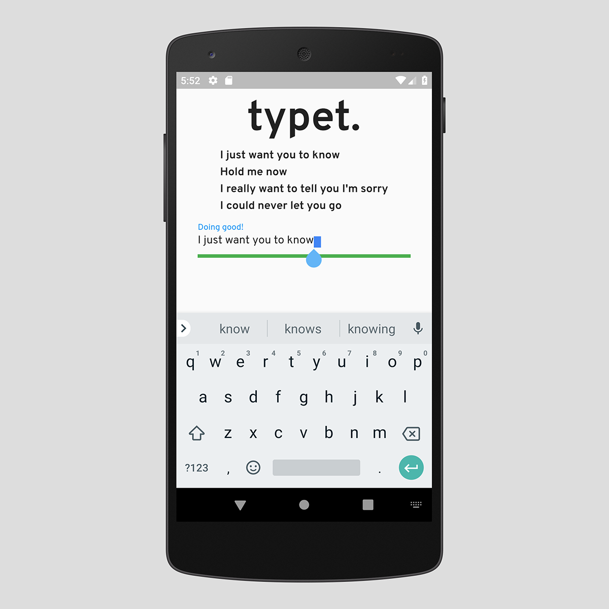

# 🖮 Typ'em
Typ'em gauges your typing speed with over 5000 lyrics excerpts!

## Description

**Typ'em** is a Flutter application written in Dart as an entry to Google's Create Challenge.

**Typ'em** gauges a user's texting speed by pitting them again over 5000 lyrics excerpt. The lyrics are retrieved from [LyricsOVH API](https://lyricsovh.docs.apiary.io/) free API. A CSV file containing >5000 artist and song titles are located in the application's asset folder. These are used as the arguments for the API.

An excerpt is taken from the chosen song's lyrics and the user's gross WPM is calculated with [SpeedTyping](https://www.speedtypingonline.com/typing-equations) Gross WPM equation. Users can get new lyrics by simply pulling down on the screen.

## Design caveats:
Due to the strict 5KB Dart code size, certain caveats were taken to ensure code size remains within limit but readability is not sacrificed.

Primarily:
* The use of dynamic typing and removing of return type instead of strict typing.
* Lack of modularity between nested widget i.e. in `Row()`
* Short 'ambiguous' variable names and method names.
* Single character variables for lambda variable naming.

Given a higher size limit, these compromises should be fixed.

## Potential fixes for future versions:
* Standardize lyrics output by removing all non alpha characters i.e. `!?()`
* Better text sanitization.
* Switch gross WPM for true WPM by taking into account error rates.
* Link to Spotify API for music discovery.

## Getting Started
1) Clone the repository.
2) Navigate to root of the repository.
3) Execute `flutter run`.

### Dependencies
* Flutter v1.3.2
* Android Studio (if running on the emulator).
* **Typ'em** is targeted towards Android devices with the following versions:
    * `minSdkVersion` 16
    * `targetSdkVersion` 28

### Installing
Download the APK from Release Page and install on Android device with Android Package Manager.

### Executing program
After installation, launch the application from your device's main launcher.

## Help
Got a query? Contact addisonho@outlook.com

## Authors
* Addison Ho - [@carrein](https://addisonho.com)

## Version History
* 1.0
    * Initial Release

## Acknowledgments
* [LyricsOVH API](https://lyricsovh.docs.apiary.io/)

## License

This project is licensed under the MIT License - see the LICENSE.md file for details